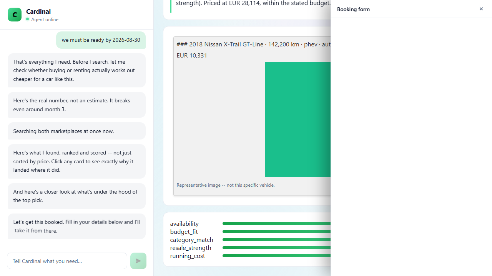

# Cardinal

Cardinal is an **advisor**, not a filter. Every car marketplace makes you already know what you
want; Cardinal interviews a buyer or renter, does the arithmetic they can't do in their head
(rent-vs-buy total cost of ownership over *their* horizon), researches two marketplaces in
parallel, and returns a ranked recommendation it can defend with a number, not an adjective —
with the booking form and mock checkout rendered *inside the conversation* as MCP Apps and every
catalogue, progress view and score breakdown drawn by the agent through A2UI.



> **Synthetic inventory, mock payments.** The 240 listings in this repository are generated, not
> scraped — the brands are real, the cars are not. No real marketplace is contacted and no real
> payment gateway is reachable from this codebase (see [`CONSTITUTION.md`](CONSTITUTION.md) §I).
> See [What's real and what's mocked](#whats-real-and-whats-mocked) below.

## Run it

```bash
git clone <this repo> && cd Car-Matchmaker
cp .env.example .env          # defaults are enough -- DEMO_MODE=true needs nothing else
docker compose up --build
```

Open <http://localhost:5173>. Click **Start Demo** — the full interview → rent-vs-buy break-even
→ parallel research → ranked results → score breakdown → powertrain explainer → booking App →
mock checkout flow runs with **zero API keys**, because `DEMO_MODE=true` is what `.env.example`
ships with (CONSTITUTION III.7). `docker compose up` seeds 240 listings on first boot; `curl
localhost:8000/health` reports the count directly.

To run it against a live model instead of the scripted demo, set `ANTHROPIC_API_KEY` in `.env`
and unset `DEMO_MODE` — the same containers, the same compose file.

Locally, without containers:

```bash
python -m venv .venv && .venv/Scripts/pip install -e ".[dev]"   # POSIX: .venv/bin/pip
make test                                                        # unit + contract + integration
make gate PHASE=1                                                # one phase's exit gate
make verify                                                      # lint + typecheck + test + gates
```

With `CARDINAL_DATABASE_URL` unset the API serves the generated catalogue straight from memory, so
everything above runs with no database at all.

Status: [`PROGRESS.md`](PROGRESS.md) — the only source of truth for what actually exists. Plan:
[`plans/PLAN-00-OVERVIEW.md`](plans/PLAN-00-OVERVIEW.md).

## Architecture

```
┌──────────────────────── web/ — Vite + React 19 ────────────────────────┐
│  chat rail (plain React)  │  A2UI canvas (@a2ui/react)  │  MCP App host │
│                           │  agent-composed surfaces     │  SEP-1865     │
│                           │  catalog-validated           │  sandboxed    │
└──────────┬────────────────┴──────────────┬───────────────┴───────┬──────┘
           │ POST actions                  │ SSE: A2UI messages    │ postMessage JSON-RPC
┌──────────┴───────────────────────────────┴───────────────────────┴──────┐
│  src/api — FastAPI (transport only)                                      │
├──────────────────────────────────────────────────────────────────────────┤
│  src/agent — Claude Agent SDK orchestrator                               │
│    phase machine · subagents (interviewer/researcher×N/critic/explainer) │
│    hooks + can_use_tool guardrails · session store · memory tiers        │
├──────────────────────────────────────────────────────────────────────────┤
│  src/mcp                                                                 │
│    marketplace-mcp   search · get · availability · quote · tco           │
│    ui-mcp            render_progress · render_results · compose_surface  │
│    booking-mcp       ui://booking/form · ui://checkout/payment           │
│                      submit_draft · confirm_booking [app-only]           │
├──────────────────────────────────────────────────────────────────────────┤
│  src/adapters   MarketplaceAdapter protocol → MockDriveNow, MockAutoBazaar│
│  src/domain     Listing · RequirementProfile · Scorer · TcoEngine         │
└──────────────────────────────────────────────────────────────────────────┘
              PostgreSQL + pgvector      OpenTelemetry → Langfuse
```

`booking-mcp` runs as its own `docker compose` service (`booking`), not a subprocess of `api` —
its own hostname, so a slow or compromised marketplace call can never take checkout down with it,
and so local Docker behaves the same way a real deployment would (PHASE-11 §3). Full layering
rules: [`plans/PLAN-00-OVERVIEW.md`](plans/PLAN-00-OVERVIEW.md) §2.

```
src/domain/      pure Python: models, scoring, TCO. No I/O, no framework.
src/adapters/    marketplace adapters, catalogue generator, Postgres storage.
src/agent/       orchestration, phase machine, subagents, memory. Never imports fastapi.
src/mcp/         three MCP servers (marketplace, ui, booking) + the A2UI compiler.
src/api/         FastAPI. Transport only — the only package allowed to import fastapi.
web/             Vite + React 19: A2UI renderer + MCP App host.
scripts/         gate_phase{0..11}.py, seed_marketplace.py
tests/           unit, contract (parametrised over every adapter), integration
```

## What's real and what's mocked

| Piece | Status |
|---|---|
| The 240-listing catalogue | **Generated**, deterministically seeded (`scripts/seed_marketplace.py`) — real brands, synthetic cars, synthetic pricing/mileage/depreciation correlations |
| `MockAutoBazaar` / `MockDriveNow` | **Mock adapters** implementing the real `MarketplaceAdapter` protocol a live dealer feed or rental API would (PLAN-00 §6.4) — swapping in a real one is a new adapter file, not a rewrite |
| Ranking, scoring, TCO/break-even math | **Real.** Deterministic, unit-tested, zero fabricated figures — the model chooses *weights*, this code computes the *score* (CONSTITUTION II.2) |
| Rent-vs-buy break-even, financing amortisation | **Real** math against illustrative-but-labelled constants (`src/domain/constants.py`) — regional tax/insurance tables are `[SCALE]` |
| MCP Apps host (cross-origin sandbox, CSP, RPC proxy) | **Real** — SEP-1865-shaped double-iframe isolation, gated by Playwright against a real running backend (gate 7) |
| Booking lifecycle, idempotency, gesture-token gate | **Real** state machine, real audit trail, real single-use tokens — no shortcuts taken to make the demo easier |
| Payment gateway | **Mock.** `MockPaymentGateway` behind a real `PaymentGateway` protocol seam (CONSTITUTION I.1) — no payment SDK, API key, or provider identifier anywhere in this repository, enforced by a CI denylist scan (gates 8.7, 10.3) |
| `confirm_booking` | **Real tool, architecturally invisible to the model.** `visibility: ["app"]` — the model's toolset does not contain it; a trusted browser click plus a 30-second single-use gesture token are what reach it (CONSTITUTION I.2) |
| PowertrainExplainer 3D models | **Placeholder** hand-built glTF cubes, honestly labelled "representative image" — real geometry is a file swap, not a code change |
| Langfuse / OpenTelemetry tracing | **Real** spans always; **real export** to Langfuse only if `LANGFUSE_PUBLIC_KEY`/`LANGFUSE_SECRET_KEY` are set (no self-hosted Langfuse container — DECISIONS.md D-048) |

## Requirement traceability

Every brief requirement maps to exactly one phase and the gate that proves it. Judges are scoring
against a rubric — this is the map.

| Brief requirement | Owner | Gate criterion that proves it |
|---|---|---|
| Conversational interview (goal, category, budget, date) | P3 | 10 scripted personas each reach a complete profile |
| Research + rank across marketplaces, explained | P5 | Determinism + precision@3 ≥ 0.8 + groundedness |
| Form-fill flow **as an MCP App** | P7 | Cross-origin iframe + CSP + RPC audit log |
| Mock payment **as an MCP App** | P8 | State machine + idempotency + no-real-gateway scan |
| Catalogues + progress via **A2UI** | P6 | Every emitted message validates against the catalog |
| No real payments, no BMW Group APIs | P8, P10 | Static denylist scan, CI-run |
| ≥100 listings / ≥10 categories / ≥10 brands per category | P1 | Counts asserted and printed (240 / 12 / ≥11) |
| State across interview → research → recommend | P3, P4 | Restart-resume + cross-session recall |
| Multistep agent framework | P3 | Subagent fan-out visible in the trace |
| Spec-driven development | P0 | spec-kit artifacts committed (`specs/`) |
| Docker or public deploy | P11 | Clean clone → `docker compose up` → e2e green |
| Public repo + README | P11 | Fresh-machine run-through (gate 11.8) |
| Deck + demo video | P11 | Checked in under `docs/` |
| *Bonus:* Langfuse/Phoenix + OTel | P9 | Trace spans all phases; eval harness scores 9 metrics |
| *Optional:* marketplace as an MCP App | P2 | `marketplace-mcp` runs standalone over stdio (registry submission is `[SCALE]`) |

## The three guardrails that matter most

1. **`confirm_booking` is invisible to the model.** Turns "we told it not to" into "it cannot."
2. **The scorer reads structured fields, not prose.** Rankings are reproducible and prompt
   injection through listing text is economically pointless, in one decision.
3. **Every gate is run, not read.** `PROGRESS.md`'s numbers are pasted from real command output.

Full list, indexed by gate: [`plans/GUARDRAILS.md`](plans/GUARDRAILS.md).

## Licence

MIT — see [`LICENSE`](LICENSE). Cardinal is a clean-room build for the Amulate Summer Hackathon
2026; nothing in this repository is carried over from any other, differently-licensed project
(DECISIONS.md D-047).

Attribution: `@a2ui/react`/`@a2ui/web_core` (Apache-2.0, Google), the Claude Agent SDK
(Anthropic), and the third-party packages pinned in `pyproject.toml`/`web/package.json`. No
third-party 3D or image assets are used — `docs/ATTRIBUTION.md` will gain an entry the day a
placeholder GLB is replaced with licensed geometry (currently `[SCALE]`, PROGRESS.md's Phase 10
entry).
