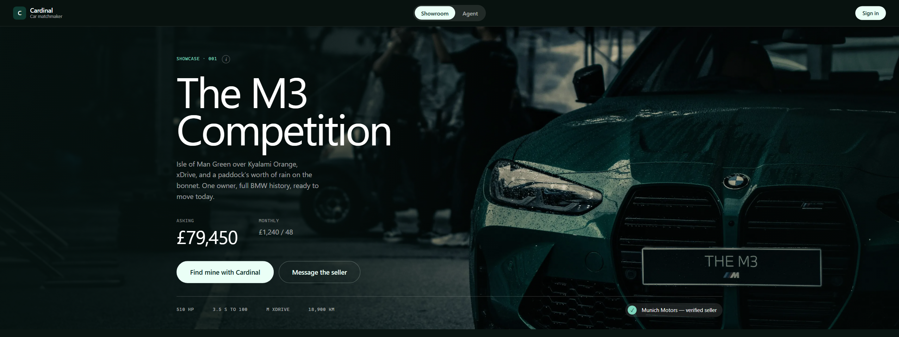
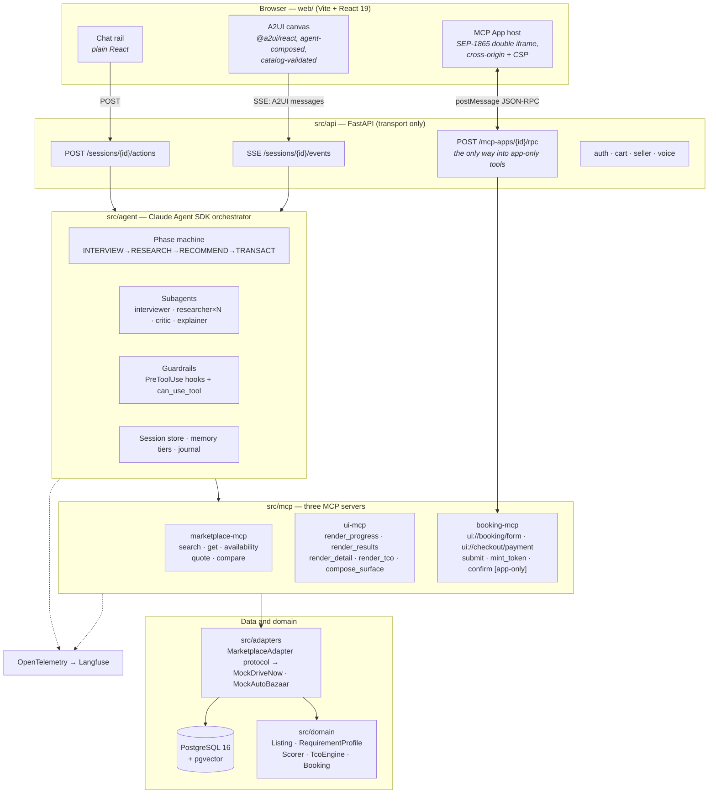
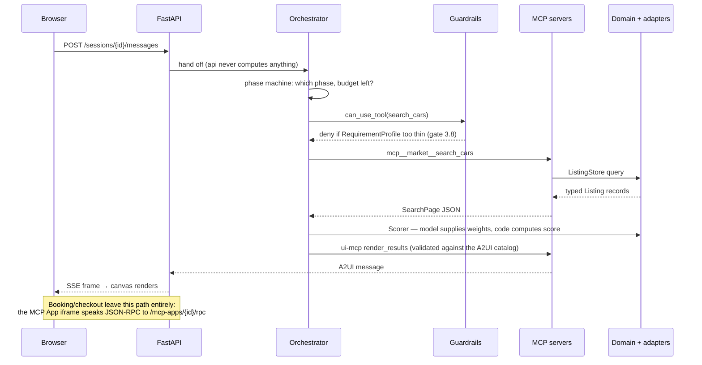

# Cardinal

**A multistep car-buying agent that interviews you, does the arithmetic you can't do in your
head, researches two marketplaces in parallel, and defends its recommendation with a number
instead of an adjective — with booking and mock checkout happening inside the conversation.**

Every car marketplace assumes you already know what you want. Cardinal is an **advisor**, not a
filter: it interviews a buyer or renter, computes rent-vs-buy total cost of ownership over
*their* horizon, researches a rental marketplace and a dealership marketplace at the same time,
and returns a ranked shortlist where every quantitative claim is traceable to a field on a real
listing record. The booking form and the checkout are rendered as **MCP Apps** inside the chat;
the catalogues, progress views and score breakdowns are drawn by the agent through **A2UI**.

> 🎬 **[Interactive project walkthrough →](https://claude.ai/code/artifact/281ded89-fdde-4dd1-b252-3f8f4f89176b)**
> See what Cardinal does without cloning or running anything.



> **Synthetic inventory, mock payments, dummy accounts.** The 240 listings in this repository are
> generated, not scraped — the brands are real, the cars are not. No real marketplace is
> contacted and no real payment gateway is reachable from this codebase
> ([`CONSTITUTION.md`](CONSTITUTION.md) §I). See
> [What's real and what's mocked](#whats-real-and-whats-mocked).

Built for the **Amulate Summer Hackathon 2026**, and deliberately structured so the same codebase
is the v0 of a real product rather than a demo that has to be thrown away.

---

## Contents

- [Quick start](#quick-start) — [Docker](#docker-everything-zero-api-keys) ·
  [local](#local-without-containers) · [development commands](#development-commands)
- [What it actually does](#what-it-actually-does) — the eight beats of the flow
- [Architecture](#architecture)
  - [System topology](#system-topology) · [Request lifecycle](#request-lifecycle) ·
    [Layering rules](#layering-rules) · [Package by package](#package-by-package)
- [Technology stack](#technology-stack)
- [The agent](#the-agent) — phase machine, subagents, guardrails, memory
- [The MCP surface](#the-mcp-surface) — three servers, sixteen tools
- [Generative UI](#generative-ui) — A2UI and MCP Apps
- [The domain model](#the-domain-model) — scoring, TCO, financing, trust
- [Marketplace and data](#marketplace-and-data)
- [Accounts, cart, dealers, sellers, voice](#accounts-cart-dealers-sellers-voice)
- [What's real and what's mocked](#whats-real-and-whats-mocked)
- [Configuration](#configuration)
- [Testing and the gate system](#testing-and-the-gate-system)
- [Requirement traceability](#requirement-traceability)
- [Repository layout](#repository-layout)
- [Documentation index](#documentation-index)
- [Licence and attribution](#licence-and-attribution)

---

## Quick start

### Docker (everything, zero API keys)

```bash
git clone <this repo> && cd Car-Matchmaker
cp .env.example .env          # defaults are enough -- DEMO_MODE=true needs nothing else
docker compose up --build
```

Open <http://localhost:5173> and click **Start Demo**. The full interview → rent-vs-buy
break-even → parallel research → ranked results → score breakdown → powertrain explainer →
booking App → mock checkout flow runs with **no API keys at all**, because `DEMO_MODE=true` is
what `.env.example` ships with (CONSTITUTION III.7). First boot runs the Alembic migrations and
seeds 240 listings; `curl localhost:8000/health` reports the count directly.

This starts four services:

| Service | Port | What it is |
|---|---|---|
| `web` | `5173` → nginx `8080` | Vite-built React SPA |
| `api` | `8000` | FastAPI: SSE stream, actions, MCP App RPC proxy, auth, cart, seller |
| `booking` | `8100`, **unpublished** | booking-mcp's own HTTP transport, its own origin |
| `postgres` | `5432` | Postgres 16 + pgvector |

`booking` is a separate compose service on its own hostname rather than a subprocess of `api` —
so a slow or compromised marketplace call can never take checkout down with it, and so local
Docker behaves the way a real deployment would (PHASE-11 §3). No host port is published for it;
only `api` reaches it, server-side, over the compose network.

### Live model instead of the scripted demo

Set `ANTHROPIC_API_KEY` in `.env` and remove `DEMO_MODE` — same containers, same compose file.

### Local, without containers

You need **two terminals** — one for the API, one for the web dev server.

**Terminal 1 — install and run the API:**

```powershell
# Windows (PowerShell)
python -m venv .venv
.venv\Scripts\Activate.ps1
pip install -e ".[dev]"

$env:DEMO_MODE = "true"
python -m uvicorn src.api.main:app --reload --port 8000
```

```bash
# macOS / Linux
python -m venv .venv && source .venv/bin/activate
pip install -e ".[dev]"

DEMO_MODE=true python -m uvicorn src.api.main:app --reload --port 8000
```

**Terminal 2 — the web app:**

```bash
cd web
npm install
npm run dev            # http://localhost:5173
```

Open <http://localhost:5173>.

> **`DEMO_MODE` must be set in the environment here, not in `.env`.** Nothing in the Python code
> reads a `.env` file — `docker compose` loads it via `env_file`, which is why the Docker path
> above only needs `cp .env.example .env`. Running locally, export the variable as shown or the
> app will try to reach a live model and fail on the first message.

Check it came up: `curl localhost:8000/health` should report
`{"status":"ok","backend":"memory","demo_mode":true,"listings":240,...}`. With
`CARDINAL_DATABASE_URL` unset the API serves the generated catalogue **straight from memory**, so
all of this runs with no database at all — deliberately, so a fresh clone works with nothing
installed but Python and Node.

### Development commands

The [`Makefile`](Makefile) wraps these. **`make` is not installed on Windows by default**, so the
raw equivalent is given for each — they are what the target runs:

| Task | `make` | Raw command |
|---|---|---|
| Run the API | `make dev` | `python -m uvicorn src.api.main:app --reload --port 8000` |
| Tests | `make test` | `python -m pytest tests -q` |
| Lint | `make lint` | `python -m ruff check src tests scripts` then `python -m ruff format --check src tests scripts` |
| Format in place | `make format` | `python -m ruff format src tests scripts` |
| Typecheck | `make typecheck` | `python -m mypy --strict src/domain` then `python -m mypy src/agent src/adapters src/api src/mcp` |
| One phase gate | `make gate PHASE=5` | `python -m scripts.gate_phase5` |
| Every gate, 0..16 | `make gates` | `python -m scripts.gate_phase0`, `1`, `2`, … in order |
| Everything, chained | `make verify` | lint + typecheck + test + gates |
| Seed Postgres | `make seed` | `python -m scripts.seed_marketplace` |
| Migrate | `make migrate` | `python -m alembic upgrade head` |
| Web typecheck / build | — | `cd web && npm run typecheck` / `npm run build` |
| Web e2e | — | `cd web && npm run test:e2e` |

Status of every phase: [`PROGRESS.md`](PROGRESS.md) — the only source of truth for what exists.

---

## What it actually does

The demo flow, in the order a judge sees it. Each beat has a screenshot in
[`docs/screenshots/`](docs/screenshots/).

1. **Interview.** The agent asks about goal (rent vs buy), category, budget, dates and
   constraints. A *code-owned* phase machine — not the model — decides when the profile is
   complete enough to move on.
2. **Rent-vs-buy break-even.** Real arithmetic over the user's own horizon: the month at which
   buying overtakes renting, itemised rather than reduced to one unpersuasive number.
3. **Parallel research.** Researcher subagents fan out across two marketplaces at once; the
   progress surface is drawn live by the agent through A2UI.
4. **Ranked results.** Deterministic scoring. The model chooses the *weights*; this code computes
   the *score* (CONSTITUTION II.2). Open any card for the full breakdown.
5. **Powertrain explainer.** A 3D model view explaining what an EV/hybrid/ICE drivetrain means
   for this specific buyer's costs.
6. **Booking.** A real form, rendered as a sandboxed **MCP App** inside the conversation.
7. **Mock checkout.** A second MCP App. Payment is a mock behind a real `PaymentGateway` seam —
   **no payment SDK, key, or provider identifier exists anywhere in this repository.**
8. **Trace and audit log.** Every tool call, with an args hash and duration, as OpenTelemetry
   spans; the MCP App RPC audit log is queryable over HTTP.

---

## Architecture

### System topology



### Request lifecycle

One user turn, end to end — this is the path worth understanding before reading any file:



### Layering rules

One-way dependencies, enforced by tooling rather than by convention:

```
src/domain/      pure Python: models, scoring, TCO, financing, trust.
                 No I/O, no network, no clock, no framework.
      ▲
src/adapters/    marketplace adapters, catalogue generator, Postgres storage,
                 payments, identity, cart, dealers, leads, voice providers.
      ▲
src/agent/       orchestration, phase machine, subagents, guardrails, memory.
      ▲          Never imports fastapi.
src/mcp/         three MCP servers + the A2UI compiler. Never imports src/agent.
      ▲
src/api/         FastAPI. Transport only — the only package allowed to import fastapi.
```

**`src/domain`, `src/adapters` and `src/agent` never import `fastapi`.** This is enforced twice,
deliberately: a `ruff` banned-api rule catches it while you type
([`pyproject.toml`](pyproject.toml) `flake8-tidy-imports`), and
[`tests/test_layer_boundary.py`](tests/test_layer_boundary.py) catches it when someone adds a
`# noqa`. Full rules: [`plans/PLAN-00-OVERVIEW.md`](plans/PLAN-00-OVERVIEW.md) §2.

### Package by package

<details>
<summary><b><code>src/domain/</code></b> — pure Python, no I/O, no framework (23 modules)</summary>

| Module | Responsibility |
|---|---|
| `listing.py` | The canonical vehicle record. Every adapter normalises to this (CONSTITUTION II.6) |
| `profile.py` | `RequirementProfile` — typed interview state; what the phase machine evaluates |
| `marketplace.py` | `SearchQuery`, `SearchPage`, `QuoteTerms` — query/result contracts |
| `scoring.py` | `FieldRef` (the grounding primitive), `CriterionWeight`, score contracts |
| `ranking.py` | The ranking engine: reads a real `Listing` + model-chosen weights → a score |
| `tco.py` | Total cost of ownership, **itemised** — a single number is unpersuasive, a breakdown is an argument |
| `costs.py` | Shared monthly running-cost formulas (energy, insurance, maintenance, road tax) |
| `financing.py` | Term / APR / down payment → monthly payment amortisation |
| `constants.py` | Illustrative-but-labelled TCO constants, isolated so they are auditable |
| `booking.py` | Booking contracts and the booking lifecycle state machine |
| `payments.py` | Payment contracts — shapes only; the gateway lives behind a protocol seam |
| `trust.py` | Untrusted-content handling for marketplace listing text (CONSTITUTION I.4) |
| `money.py` | `Decimal` inside, never a float |
| `dates.py` | `DateRange`, shared by booking and availability |
| `memory.py` | Memory-tier and decision-journal contracts |
| `identity.py` · `cart.py` · `dealer.py` · `lead.py` · `lead_scoring.py` · `voice.py` | Phases 12–16 |

</details>

<details>
<summary><b><code>src/adapters/</code></b> — everything that touches the outside world</summary>

- **`protocol.py`** — the `MarketplaceAdapter` protocol a live dealer feed or rental API would
  implement. Swapping in a real marketplace is *a new adapter file*, not a rewrite.
- **`mock/drivenow.py`, `mock/autobazaar.py`** — the two mock marketplaces (rental and
  dealership), both implementing that protocol; `registry.py` wires them up.
- **`catalogue/generator.py`, `catalogue/taxonomy.py`, `catalogue/dealers.py`** — the
  deterministic 240-listing generator, its category taxonomy, and the synthetic dealer directory.
- **`db/`** — SQLAlchemy 2.0 models, Alembic-migrated schema, and stores for listings, bookings,
  identity, cart, dealers and leads. `session.py` degrades to in-memory when
  `CARDINAL_DATABASE_URL` is unset.
- **`payments/protocol.py` + `payments/mock.py`** — `PaymentGateway` seam and its mock.
- **`oauth/google.py`** — optional Google sign-in.
- **`voice/cascade.py`, `voice/providers.py`** — the three-tier voice cascade.
- **`filtering.py`** — shared query filtering used by both adapters.

</details>

<details>
<summary><b><code>src/agent/</code></b> — the orchestration layer</summary>

- **`orchestrator.py`** — drives the Claude Agent SDK session; owns the turn loop.
- **`phase_machine.py`** — pure, I/O-free state machine. Phases and per-phase turn budgets
  (`INTERVIEW: 12`, `RESEARCH: 6`, `RECOMMEND: 10`, `TRANSACT: 8`), enforced as hard caps.
- **`subagents.py`** — the roster: `interviewer`, `researcher` (fanned out), `critic`,
  `explainer`, as SDK `AgentDefinition`s.
- **`guardrails.py`** — two mechanisms with different jobs: a `PreToolUse` audit hook (every call
  logged with an args hash) and a `can_use_tool` gate that *denies* `search_cars`/`compare_listings`
  before the interview has filled enough required slots.
- **`prompts.py`** — loads the role prompts, which live as plain Markdown in
  [`prompts/`](prompts/) (`orchestrator_system`, `interviewer`, `interview_chat`, `researcher`,
  `critic`, `explainer`, `slot_extraction`) so they are reviewable as prose rather than buried in
  string literals.
- **`session_store.py`**, **`journal.py`** — session state and the decision journal.
- **`research.py`**, **`interview.py`**, **`interview_chat.py`**, **`extraction.py`** — phase logic.
- **`providers.py`**, **`model_catalog.py`** — model routing (the interview phase may run on a
  non-Claude model; RESEARCH/RECOMMEND/TRANSACT are always Claude).
- **`demo.py`**, **`demo_stream.py`** — the scripted `DEMO_MODE` path.
- **`tracing.py`**, **`evals.py`** — OpenTelemetry setup and the 9-metric eval harness.

</details>

<details>
<summary><b><code>src/mcp/</code></b> — three MCP servers plus the A2UI compiler</summary>

- **`audience.py`** — tool visibility, the enforcement mechanism behind CONSTITUTION I.2. Also
  the single choke point where every tool handler is wrapped in a `tool.<name>` span.
- **`marketplace/`** — search, get, availability, quote, compare. Runs standalone over stdio too.
- **`ui/`** — the A2UI surface tools plus `compiler.py`, `catalog.py` and `validate.py`: **every**
  emitted message is validated against a component catalog before it reaches the browser.
- **`booking/`** — the two MCP App resources (`ui://booking/form`, `ui://checkout/payment`), their
  static HTML, the gesture-token minter, and its own HTTP transport (`http.py`).
- **`apps/`** — `proxy.py`, `audit.py`, `meta.py`: the host-side MCP Apps plumbing.

</details>

<details>
<summary><b><code>src/api/</code></b> — FastAPI, transport only</summary>

| Route group | File | Endpoints |
|---|---|---|
| Core | `main.py` | `/health`, `/adapters`, `/models`, `/sessions/{id}/events` (SSE), `/sessions/{id}/actions`, `/sessions/{id}/messages`, `/demo/{id}/start`, `/mcp-apps/{id}/rpc`, `/mcp-apps/{id}/audit` |
| Auth | `auth.py` | `/auth/request-otp`, `/auth/verify-otp`, `/auth/me`, `/auth/logout`, `/auth/providers`, `/auth/google/start`, `/auth/google/callback`, `/auth/claim-dealership` |
| Cart | `cart.py` | `/cart/items` (GET/POST/DELETE), `/cart/checkout`, `/cart/count` |
| Seller | `seller.py` | `/seller/profile`, `/seller/dealers`, `/seller/leads`, `/seller/leads/{id}/contacted`, `/seller/events` (SSE) |
| Voice | `voice.py` | `/voice/capabilities`, `/voice/speak`, `/voice/transcribe` |

</details>

<details>
<summary><b><code>web/</code></b> — Vite + React 19</summary>

Routes (`src/routes.tsx`): `/` showroom · `/login` · `/chat` (the agent) · `/cart` · `/seller`.

- **`src/a2ui/`** — the A2UI renderer binding and component catalog.
- **`src/mcp-host/`** — the MCP App host: `McpAppHost.tsx`, `csp.ts`, `hostBridge.ts`,
  `protocol.ts`, `rpcChannel.ts`, `sandboxOrigin.ts`, `sandboxProxyEntry.ts`,
  `outerEntry.ts` — the SEP-1865-shaped double-iframe isolation.
- **`src/ui/`** — the in-house component kit (`Button`, `Card`, `Badge`, `Input`, `Tabs`,
  `Separator`, `Slot`, `cn`) over `tokens.css`. **No Tailwind, no component dependency**:
  shadcn's token *vocabulary* and anatomy, implemented in plain CSS.
- **`src/showroom/`**, **`src/auth/`**, **`src/cart/`**, **`src/seller/`**, **`src/voice/`** —
  the front page and the phase 12–16 surfaces.
- **`tests/`** — 12 Playwright specs, run against a real backend by the gate scripts.

</details>

---

## Technology stack

### Backend

| Technology | Version | Why it's here |
|---|---|---|
| **Python** | ≥ 3.12 | `StrEnum`, `Self`, `itertools.pairwise`, PEP 604 unions used throughout |
| **Claude Agent SDK** | ≥ 0.2.132 | The multistep agent framework: subagent definitions, `PreToolUse` hooks, `can_use_tool`, in-process MCP servers |
| **MCP** (`mcp`) | ≥ 1.29 | Model Context Protocol — three servers, stdio + HTTP transports, MCP Apps resources |
| **FastAPI** | ≥ 0.111 | HTTP transport and SSE only. The *only* package allowed to import it |
| **Uvicorn** | ≥ 0.29 | ASGI server |
| **Pydantic** | ≥ 2.9 | Every domain contract is a frozen Pydantic model — validation at the boundary, typed everywhere inside |
| **pydantic-settings** | ≥ 2.4 | Config; no secret has a default, so a missing one fails loudly at startup |
| **SQLAlchemy** | ≥ 2.0.30 | Typed ORM, 2.0 style |
| **Alembic** | ≥ 1.13 | Migrations (`migrations/versions/0001`…`0006`) |
| **psycopg** | ≥ 3.2 | Postgres driver |
| **pgvector** | ≥ 0.3 | Vector column support — the image is Postgres + the extension, so `[SCALE]` semantic search needs no second container |
| **OpenTelemetry** | ≥ 1.44 | API, SDK and OTLP/HTTP exporter — real spans always, export only when keys are set |
| **openinference-instrumentation-claude-agent-sdk** | ≥ 0.1.9 | Auto-instruments the agent SDK into those spans |

### Frontend

| Technology | Version | Why it's here |
|---|---|---|
| **React** | 19 | UI |
| **Vite** | 6 | Dev server (with an API proxy) and production build |
| **TypeScript** | 5.6 | `tsc -b` in the build and as a standalone typecheck |
| **`@a2ui/react` / `@a2ui/web_core`** | 0.9.1 | Agent-to-UI: the agent composes surfaces, the browser renders them |
| **react-router-dom** | 7 | The five routes |
| **zod** | 3 | Runtime validation of everything crossing the SSE and RPC boundaries |
| **`@google/model-viewer`** | 4 | The glTF powertrain explainer |
| **Playwright** | 1.48 | 12 e2e specs — several phase gates are *only* provable in a real browser |

### Infrastructure and tooling

| Technology | Why it's here |
|---|---|
| **Docker Compose** | Four services; healthchecks ordered so a cold clone migrates and seeds before racing anything |
| **PostgreSQL 16 + pgvector** | `pgvector/pgvector:pg16` |
| **nginx** | Serves the built SPA and proxies to `api` by compose hostname |
| **ruff** | Lint + format, line length 100, `E F I UP B TID ASYNC RUF`, plus the banned-`fastapi` rule |
| **mypy** | `--strict` on `src/domain`; standard over agent/adapters/api/mcp, so `make verify` stays fast enough to actually run |
| **pytest** + **pytest-asyncio** | 60 test modules; a `postgres` marker skips DB tests when no database is configured |
| **Langfuse** | Optional trace sink (cloud or self-hosted via `LANGFUSE_HOST`) |
| **spec-kit** | Spec-driven development artifacts under [`specs/`](specs/) and `.specify/` |

### Optional third-party services

All of these are **optional**; with every key unset the product still runs end to end.

| Service | Used for | Absent behaviour |
|---|---|---|
| Anthropic | The agent itself | `DEMO_MODE=true` runs the scripted flow |
| Groq / Gemini / OpenRouter / OpenAI | Alternate **interview-phase** model only | Falls back to Claude |
| ElevenLabs + Groq Whisper | Voice tier 1 | Drops to the browser's Web Speech API, then to text |
| Google OAuth | Sign-in provider | OTP sign-in remains |
| Langfuse | Trace export | Spans stay in-process |

---

## The agent

### The phase machine owns the transitions, not the model

```
INTERVIEW ──▶ RESEARCH ──▶ RECOMMEND ──▶ TRANSACT
   12           6            10            8      ← hard turn budgets
```

The model never decides it is "done interviewing". [`phase_machine.py`](src/agent/phase_machine.py)
does, evaluated against the typed `RequirementProfile`. It is pure and I/O-free, so the whole
state machine is testable with no event loop, no SDK and no database — the same reasoning
CONSTITUTION II.1 applies to `src/domain`, applied to the one corner of `src/agent` that has no
excuse to need anything more.

### Subagents

| Role | Job |
|---|---|
| `interviewer` | Asks the questions that fill `RequirementProfile` slots |
| `researcher` | Fanned out — one per marketplace, running in parallel |
| `critic` | Challenges the shortlist before it is shown |
| `explainer` | Produces the defensible rationale attached to each recommendation |

### Guardrails

Two mechanisms, different jobs ([`guardrails.py`](src/agent/guardrails.py)):

1. **`PreToolUse` audit hook** — every tool call recorded with an args hash and duration. Also
   rejects malformed monetary fields before they reach a tool.
2. **`can_use_tool` gate** — *denies* `search_cars` and `compare_listings` until the interview has
   filled a minimum number of required slots. The agent cannot skip the interview even if the
   prompt goes wrong.

Full index of every safety mechanism, by gate: [`plans/GUARDRAILS.md`](plans/GUARDRAILS.md).

### The three guardrails that matter most

1. **`confirm_booking` is invisible to the model.** It is declared `audience=("app",)`, so it is
   never placed in the model's toolset in the first place — not a permission check that runs
   *after* the model asks. Turns "we told it not to" into "it cannot." A trusted browser click
   plus a 30-second single-use gesture token are what reach it.
2. **The scorer reads structured fields, not prose.** Rankings are reproducible, and prompt
   injection through listing text is economically pointless — in one decision.
3. **Every gate is run, not read.** `PROGRESS.md`'s numbers are pasted from real command output.

---

## The MCP surface

Sixteen tools across three servers. The `audience` column is the security boundary: `model`
tools are handed to Claude, `app` tools exist only for our own backend to invoke.

### `marketplace-mcp` — [`src/mcp/marketplace/`](src/mcp/marketplace/)

| Tool | Audience | Does |
|---|---|---|
| `search_cars` | model + app | Filtered, paged search across an adapter |
| `get_listing` | model + app | One canonical `Listing` |
| `check_availability` | model + app | Availability over a `DateRange` |
| `get_quote` | model + app | Priced quote for given terms |
| `compare_listings` | model + app | Side-by-side structured comparison |

Also runs **standalone over stdio** (`python -m src.mcp.marketplace.stdio`) so any MCP client can
use it.

### `ui-mcp` — [`src/mcp/ui/`](src/mcp/ui/)

| Tool | Does |
|---|---|
| `render_progress` | The live research progress surface |
| `render_results` | The ranked result cards |
| `render_detail` | One listing in depth, including the powertrain explainer |
| `render_tco` | The TCO / rent-vs-buy break-even surface |
| `compose_surface` | Free composition against the catalog |

Every emitted message is validated against the component catalog
([`catalog.py`](src/mcp/ui/catalog.py), [`validate.py`](src/mcp/ui/validate.py)) before it reaches
the browser. An invalid surface is rejected, not rendered.

### `booking-mcp` — [`src/mcp/booking/`](src/mcp/booking/)

| Tool | Audience | Does |
|---|---|---|
| `open_booking_form` | model + app | Opens the `ui://booking/form` MCP App |
| `open_checkout` | model + app | Opens the `ui://checkout/payment` MCP App |
| `submit_booking_draft` | **app only** | Submits the draft — the model cannot call it |
| `mint_gesture_token` | **app only** | Mints a 30-second single-use token from a real click |
| `confirm_booking` | **app only** | The one that takes the money. Invisible to the model |

---

## Generative UI

Two different mechanisms, chosen for two different trust levels:

**A2UI** for surfaces the *agent composes* — catalogues, progress, score breakdowns. The agent
emits A2UI messages over SSE; the browser renders them through `@a2ui/react` against a fixed
catalog. Agent-authored layout, but only from components we shipped.

**MCP Apps (SEP-1865)** for surfaces that *take input and money* — the booking form and checkout.
These are served as MCP **resources** (`ui://booking/form`, `ui://checkout/payment`) and mounted
in a **double iframe**: an outer host frame and an inner cross-origin sandbox with its own CSP,
talking JSON-RPC over `postMessage` through an RPC proxy. A second port on the same host is not a
different origin — hence `booking` being a genuinely separate service. Every RPC call is written
to an audit log queryable at `GET /mcp-apps/{session_id}/audit`.

---

## The domain model

### Scoring: the model picks weights, code computes the score

CONSTITUTION II.2 is the whole ranking story. [`scoring.py`](src/domain/scoring.py) defines the
seam: `CriterionWeight` is what the model produces; [`ranking.py`](src/domain/ranking.py) is what
computes. The consequence is that rankings are **deterministic and reproducible** — the same
profile and the same catalogue produce the same order, every time, which is why gate 5 can assert
`precision@3 ≥ 0.8` at all.

### Grounding: every number carries a `FieldRef`

```python
class FieldRef(BaseModel):
    listing_id: str
    field_name: str
```

Every quantitative claim in a rationale carries one. A rationale with an uncited figure is
**rejected and regenerated** — which eliminates "the agent invented a statistic", the failure that
ends a demo the moment a judge checks a number.

### TCO is itemised on purpose

A single number is unpersuasive; a breakdown is an argument, and it lets the UI show where the
money goes. Constants live in one labelled file ([`constants.py`](src/domain/constants.py)) so the
assumptions are auditable rather than buried in a formula.

### Money is `Decimal`, never a float

[`money.py`](src/domain/money.py), enforced through every layer that touches a price.

---

## Marketplace and data

- **240 listings**, **12 categories**, **≥11 brands per category** — deterministically generated
  by [`scripts/seed_marketplace.py`](scripts/seed_marketplace.py) and
  [`catalogue/generator.py`](src/adapters/catalogue/generator.py), with correlated pricing,
  mileage and depreciation rather than independent random fields.
- **Two adapters** behind one protocol: `MockDriveNow` (rental) and `MockAutoBazaar` (dealership).
  The contract tests are parametrised over *every* adapter, so a real one has a definition of done
  before it is written.
- **Untrusted listing text** goes through [`trust.py`](src/domain/trust.py) — because the scorer
  reads structured fields, injected prose has nothing to reach.

---

## Accounts, cart, dealers, sellers, voice

Phases 12–16, all shipped:

- **Identity (P12).** OTP sign-in and optional Google OAuth, buyer/seller roles. No JWT, no
  password hashing, no auth SDK, no signing secret — an opaque token in a server-side table,
  enforced by a denylist scan.
- **Dealers (P13).** A generated dealer directory behind every listing, checked against a denylist
  so no synthetic dealer name collides with a real brand or dealer group. Verification status is
  synthetic too — which is exactly why an unverified dealer is *shown* as unverified rather than
  quietly rounded up.
- **Cart (P14).** Account-scoped, with a **payee disclosure** rendered above the pay control,
  built server-side from the listing's own dealer and never from anything the page supplied.
  Checkout on `/cart` is the *same* `ui://checkout/payment` MCP App the in-chat flow mounts.
- **Seller console (P15).** Lead scoring from **seven named signals whose contributions sum to the
  score** — the model never picks the tier, and every tier renders as an estimate with its
  reasoning attached. A buyer who only browsed produces no lead and exposes no contact details,
  and **income never enters a lead score at all**, so there is nothing for the seller's screen to
  leak.
- **Voice (P16).** A three-tier cascade chosen *per call*, never per session: ElevenLabs + Groq
  Whisper → the browser's Web Speech API → plain text. All keys unset means tier 2 serves every
  utterance and the feature still works; a quota that empties mid-session drops a tier on the next
  utterance with no reload.

---

## What's real and what's mocked

| Piece | Status |
|---|---|
| The 240-listing catalogue | **Generated**, deterministically seeded — real brands, synthetic cars, synthetic pricing/mileage/depreciation correlations |
| `MockAutoBazaar` / `MockDriveNow` | **Mock adapters** implementing the real `MarketplaceAdapter` protocol a live dealer feed or rental API would — swapping in a real one is a new adapter file, not a rewrite |
| Ranking, scoring, TCO/break-even math | **Real.** Deterministic, unit-tested, zero fabricated figures — the model chooses *weights*, this code computes the *score* |
| Rent-vs-buy break-even, financing amortisation | **Real** math against illustrative-but-labelled constants; regional tax/insurance tables are `[SCALE]` |
| MCP Apps host (cross-origin sandbox, CSP, RPC proxy) | **Real** — SEP-1865-shaped double-iframe isolation, gated by Playwright against a real running backend |
| Booking lifecycle, idempotency, gesture-token gate | **Real** state machine, real audit trail, real single-use tokens |
| Payment gateway | **Mock.** `MockPaymentGateway` behind a real `PaymentGateway` protocol seam — no payment SDK, API key, or provider identifier anywhere in this repository, enforced by a CI denylist scan |
| `confirm_booking` | **Real tool, architecturally invisible to the model.** `audience=("app",)` — a trusted browser click plus a 30-second single-use gesture token are what reach it |
| Accounts and login | **Dummy, disclosed in the API rather than on screen.** Three fixed OTP codes accepted for any account; `POST /auth/request-otp` returns a `DEMO AUTH — NOT REAL SECURITY` banner and the codes in its JSON body, though neither renders on `/login` |
| Dealer directory | **Generated**, deterministically seeded, denylist-checked against real brands and dealer groups |
| Cart and payee disclosure | **Real** account-scoped cart and a real server-side disclosure of who receives the money |
| Seller console, lead scoring, SLA clock | **Real** and deterministic — seven named signals, computed by code, never by the model |
| PowertrainExplainer 3D models | **Placeholder** hand-built glTF cubes, honestly labelled "representative image" — real geometry is a file swap, not a code change |
| Langfuse / OpenTelemetry tracing | **Real** spans always; **real export** only if `LANGFUSE_PUBLIC_KEY`/`LANGFUSE_SECRET_KEY` are set |

---

## Configuration

Copy [`.env.example`](.env.example) to `.env`. It is heavily commented; the summary:

| Variable | Default | Notes |
|---|---|---|
| `DEMO_MODE` | `true` | The whole flow with **no** other variable set (CONSTITUTION III.7) |
| `ANTHROPIC_API_KEY` | — | Required only when `DEMO_MODE` is not `true` |
| `CARDINAL_AGENT_MODEL` / `_EFFORT` / `_THINKING` | cheap/fast | Uncomment all three for the plan's `claude-opus-5` / high-effort routing |
| `CARDINAL_INTERVIEW_MODEL` | `groq/qwen/qwen3.6-27b` | Interview phase only; set to `claude` to put the whole session on the Agent SDK |
| `CARDINAL_SHOW_MODEL_PICKER` | `false` | Off by default, so no third-party model name reaches the browser |
| `GROQ_/GEMINI_/OPENROUTER_/OPENAI_API_KEY` | — | Only read if a session runs a non-Claude interview model |
| `ELEVENLABS_API_KEY`, `ELEVENLABS_VOICE_ID` | — | Voice tier 1 |
| `CARDINAL_DATABASE_URL` | unset → in-memory | Unset means the catalogue is served from memory rather than failing to boot |
| `CARDINAL_BOOKING_MCP_URL` | unset → local subprocess | Compose sets this to the `booking` service's hostname |
| `BOOKING_MCP_HTTP_HOST` / `_PORT` | `127.0.0.1` / `8100` | Read only by the booking transport process |
| `LANGFUSE_PUBLIC_KEY` / `_SECRET_KEY` / `_HOST` | — | All three unset → in-memory exporter, nothing leaves the process |
| `CARDINAL_API_PORT` | `8000` | Vite dev-proxy target; irrelevant inside containers |

**No secret has a default.** A missing one fails loudly at startup, never silently at the first
model call in front of a judge.

---

## Testing and the gate system

```bash
make test             # 60 Python test modules: unit, contract, integration
make lint             # ruff check + ruff format --check
make typecheck        # mypy --strict src/domain; mypy over agent/adapters/api/mcp
make gate PHASE=N     # one phase's exit gate
make gates            # every gate, 0..16, stopping at the first red one
make verify           # all of the above, chained
```

Tests are layered:

- **Unit** — the domain, in-process, no I/O.
- **Contract** — parametrised over *every* marketplace adapter, so a new adapter has a definition
  of done before it is written.
- **Integration** — the API, the stores, and Postgres-backed paths (a `postgres` marker skips
  those when `CARDINAL_DATABASE_URL` is unset).
- **End-to-end** — 12 Playwright specs against a real running backend. Several gate criteria are
  *only* provable in a real browser: cross-origin iframe isolation and CSP cannot be unit-tested.

**A phase is done when `make gate PHASE=N` prints green and its real output is pasted into
[`PROGRESS.md`](PROGRESS.md)** — run, not read (CONSTITUTION III.1). The gates are ordinary Python
scripts in [`scripts/`](scripts/), one per phase, `gate_phase0.py` … `gate_phase16.py`.

Current state: **17 gates green**, 880 tests passing / 64 skipped, ruff and mypy clean. Per-phase
detail and the pending `[SCALE]` criteria are in [`PROGRESS.md`](PROGRESS.md).

---

## Requirement traceability

Every brief requirement maps to exactly one phase and the gate that proves it.

| Brief requirement | Owner | Gate criterion that proves it |
|---|---|---|
| Conversational interview (goal, category, budget, date) | P3 | 10 scripted personas each reach a complete profile |
| Research + rank across marketplaces, explained | P5 | Determinism + precision@3 ≥ 0.8 + groundedness |
| Form-fill flow **as an MCP App** | P7 | Cross-origin iframe + CSP + RPC audit log |
| Mock payment **as an MCP App** | P8 | State machine + idempotency + no-real-gateway scan |
| Catalogues + progress via **A2UI** | P6 | Every emitted message validates against the catalog |
| No real payments, no BMW Group APIs | P8, P10 | Static denylist scan, CI-run |
| ≥100 listings / ≥10 categories / ≥10 brands per category | P1 | Counts asserted and printed (240 / 12 / ≥11) |
| State across interview → research → recommend | P3, P4 | Restart-resume + cross-session recall |
| Multistep agent framework | P3 | Subagent fan-out visible in the trace |
| Spec-driven development | P0 | spec-kit artifacts committed (`specs/`) |
| Docker or public deploy | P11 | Clean clone → `docker compose up` → e2e green |
| Public repo + README | P11 | Fresh-machine run-through (gate 11.8) |
| Deck + demo video | P11 | Checked in under `docs/` |
| *Bonus:* Langfuse/Phoenix + OTel | P9 | Trace spans all phases; eval harness scores 9 metrics |
| *Optional:* marketplace as an MCP App | P2 | `marketplace-mcp` runs standalone over stdio |

---

## Repository layout

```
Car-Matchmaker/
├── src/
│   ├── domain/          pure Python: models, scoring, TCO, financing, trust
│   ├── adapters/        marketplaces, catalogue, Postgres, payments, identity, voice
│   ├── agent/           orchestrator, phase machine, subagents, guardrails, memory
│   ├── mcp/             marketplace-mcp · ui-mcp · booking-mcp + the A2UI compiler
│   └── api/             FastAPI — transport only
├── web/                 Vite + React 19: A2UI renderer, MCP App host, 5 routes
│   ├── src/a2ui/        renderer binding + catalog
│   ├── src/mcp-host/    SEP-1865 double-iframe host
│   ├── src/ui/          in-house component kit over tokens.css
│   └── tests/           12 Playwright specs
├── scripts/             gate_phase0..16.py, seed_marketplace.py, asset generators
├── tests/               unit · contract (parametrised per adapter) · integration
├── migrations/          Alembic, 0001..0006
├── plans/               PLAN-00-OVERVIEW + one doc per phase
├── specs/               spec-kit artifacts
├── prompts/             agent role prompts
├── docs/                deck, demo script, video script, screenshots
├── CONSTITUTION.md      hard constraints + their enforcement mechanisms
├── PROGRESS.md          the only source of truth for what exists
├── DECISIONS.md         the "why" behind anything non-obvious
└── docker-compose.yml   web · api · booking · postgres
```

---

## Documentation index

| Document | What it is |
|---|---|
| [`CONSTITUTION.md`](CONSTITUTION.md) | Hard constraints and the mechanism enforcing each |
| [`PROGRESS.md`](PROGRESS.md) | **Source of truth** for what is built, with real gate output |
| [`DECISIONS.md`](DECISIONS.md) | Numbered decision log (D-001…) — the *why* |
| [`CONTRIBUTING.md`](CONTRIBUTING.md) | Setup, the rules that bite most often, and what to do before a PR |
| [`plans/PLAN-00-OVERVIEW.md`](plans/PLAN-00-OVERVIEW.md) | The full plan; one doc per phase alongside it |
| [`plans/GUARDRAILS.md`](plans/GUARDRAILS.md) | Every safety mechanism, indexed by gate |
| [`plans/PLAN-02-MARKETPLACE.md`](plans/PLAN-02-MARKETPLACE.md) | The plan behind phases 12–16 (identity, dealer, cart, seller, voice) |
| [`prompts/`](prompts/) | The agent role prompts, as reviewable Markdown |
| [`docs/DEMO-SCRIPT.md`](docs/DEMO-SCRIPT.md) | The eight-beat demo, as performed |
| [`docs/VIDEO-SCRIPT.md`](docs/VIDEO-SCRIPT.md) | Demo video narration |
| [`docs/PROPOSAL-DEALER-ECOSYSTEM.md`](docs/PROPOSAL-DEALER-ECOSYSTEM.md) | The dealer-side product proposal behind phases 13–15 |

---

## Licence and attribution

MIT — see [`LICENSE`](LICENSE). Cardinal is a clean-room build for the Amulate Summer Hackathon
2026; nothing in this repository is carried over from any other, differently-licensed project.

Attribution: `@a2ui/react` / `@a2ui/web_core` (Apache-2.0, Google), the Claude Agent SDK
(Anthropic), `@google/model-viewer` (Apache-2.0, Google), and the third-party packages pinned in
[`pyproject.toml`](pyproject.toml) and [`web/package.json`](web/package.json). The design system
follows shadcn/ui's token vocabulary and component anatomy, reimplemented in plain CSS with no
Tailwind and no component dependency.

The PowertrainExplainer models are hand-built placeholder glTF geometry, not third-party assets.
